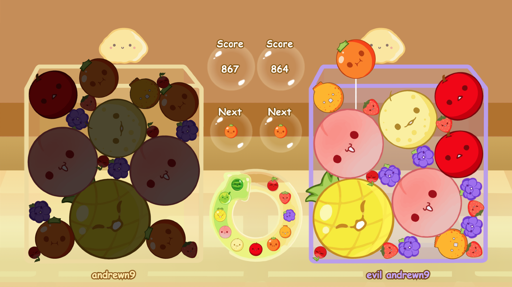

# tSuika game

Multiplayer TypeScript remake of [Suika Game](https://en.wikipedia.org/wiki/Suika_Game) for the web using PIXI.js and Matter.js.

## Features

- Room system
- Client-driven event system
- 🍒 🍓 🍇 🍊 🍎 🍐 🍑 🍍 🍈 🍉
## Run Locally

Clone the project

```bash
  git clone https:github.com/andrewn9/tsuika
```

Go to the project directory

```bash
  cd tsuika
```

Install dependencies

```bash
  npm install
```

Start the server

```bash
  npm run start
```


## Tech Stack

**Client:** PIXI.js, socket.io-client

**Server:** Node, Express, socket.io

